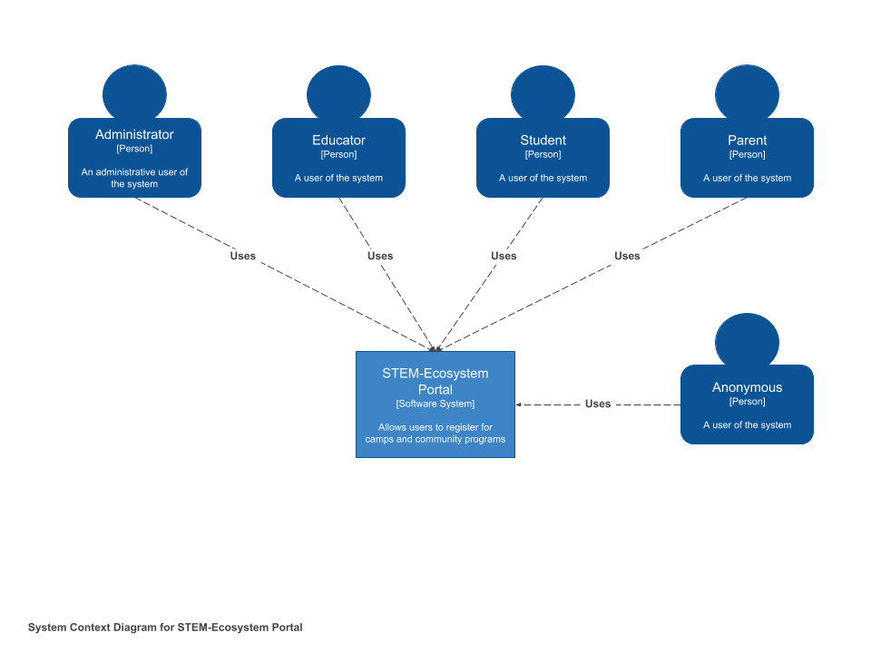
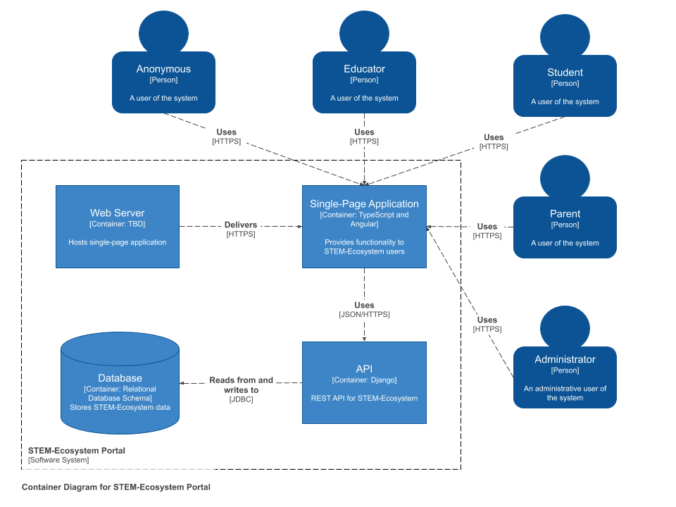
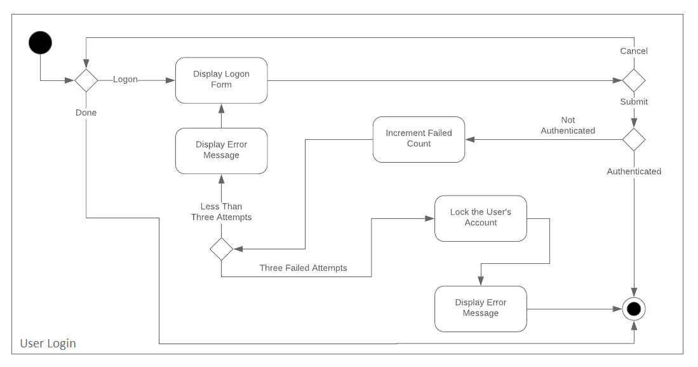
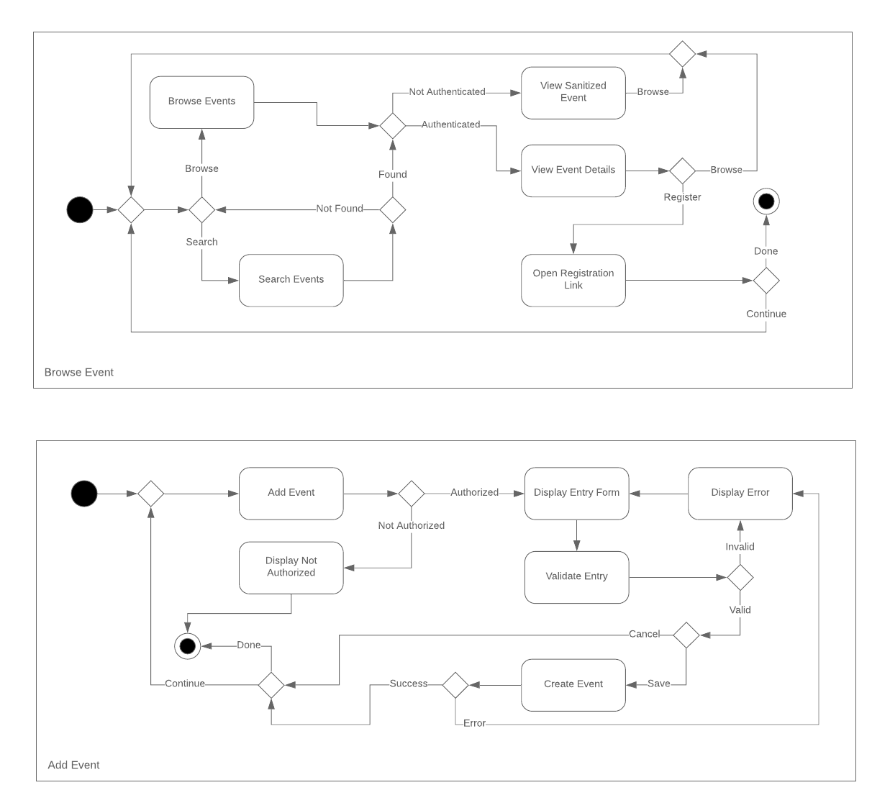

# Milestone 2

# Project Realization - Overview

Initially in Milestone 1, we planned on gathering the requirements to build the appropriate backend and frontend environments. Based on the meeting with Omaha STEM Ecosystem, we decided to follow agile methodology as a team. Each week we complete set of tickets on sprint basis.

As a team of 4 members, we divided work and have been working on two different portions of the project.

The major portion of the project (**Part 1**): Two team members worked on the ground work to build the environment for the frontend and backend based on the requirements we gathered from Omaha STEM Ecosystem.

The second portion of the project (**Part 2**): Started to work on the functionality (Home page with Nav bar, Registering Users page and Login) parts of the project.

# Progress:

The team has almost finished the major chunk (Part 1) of the project. Over the earlier weeks, we worked on completing the angular framework based frontend, Django based backend, and docker configuration to run and deploy our web application using docker container. The major reason for choosing these environments is to build a secure web application. Incorporating a Django library for JWT management (JSON Web Token) is one of the ways we integrated a tool for the purpose of security.

Since we finished building secure environments for backend and frontend, we are currently focused on implementing the major application functionalities and requirements that were discussed in the meeting with Omaha STEM Ecosystem. One of the challenges in our application is to provide a similar experience that the existing STEM Ecosystem site provides. We have identified open-source third party tools to replace the rich-content management experience that WordPress has out of the box.

We identifed the CKEditor as a tool for posting events to the site. CKEditor is a feature-rich content editor that allows for embedded links, images, font-styling, etc. We also identified [Owl Carousel](https://owlcarousel2.github.io/OwlCarousel2/) as a way to quickly display categorized events in a Netflix-like fashion. One of the front end controls we could not find a suitable tool for was file management control for uploading files. However, we found a good place to start with an existing [library](https://github.com/LukasMarx/angular-file-manager). Integrating third-party tools is one of the unique challenges that we faced and are still working through. 

Apart from building environments and implementing functionalities, our team is very concerned about security and consistency in the web application. We are implementing coding standards, naming conventions and removing unnecessary objects or lines in the code. Since we have many coding standards, we review the code to maintain the same standard before merging into the master branch. 

# Outcomes

In reaching milestone 2,  we accomplished these major tasks that were equired to start building application functionalities. We have also completed below tickets.
* Gathering requirements for the application
* Completed building secured backend and frontend environments, incorporating JWT (JSON Web Tokens)
* Completed adding the front-page UI with a navigation bar for login/logout and setting up events
* Completed adding user registration page
* Completed adding user login page
* Completed adding page for adding new events
* Identified third party tools for content management (CKEditor 5, Owl Carousel)
* Scraped event data from the existing STEM Ecosystem site for use in our application and included it in the database migration

# Hinderances

* Learning Django and Angular design patterns has pushed work items past their expected sprint completion date.
* Integrating old AngularJS and other javascript libraries into Typescript/Angular 5+. 

# Ongoing Risks

* Focusing too heavily on minor details over the critical functionality of the application itself.  
* Incorrectly designing the database objects, relationships and schema. Tightly coupling the schema into the workflows and frontend.
* Over implementing, implementing UI behavior that is annoying an/or not needed. 

# Diagrams

### System Context Diagram

### Container Diagram

### Component Diagram

### UML Activity Diagram

